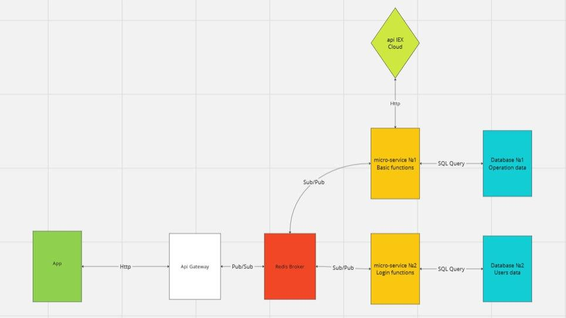
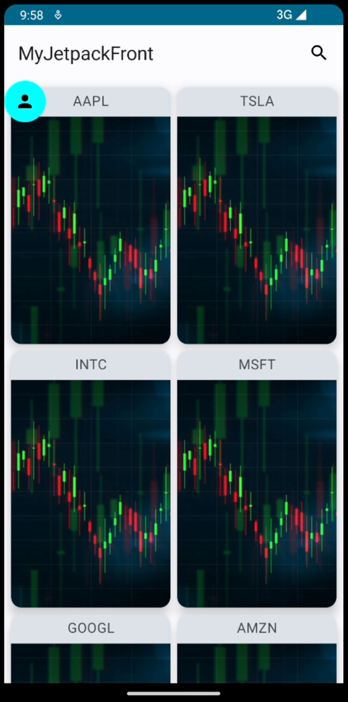
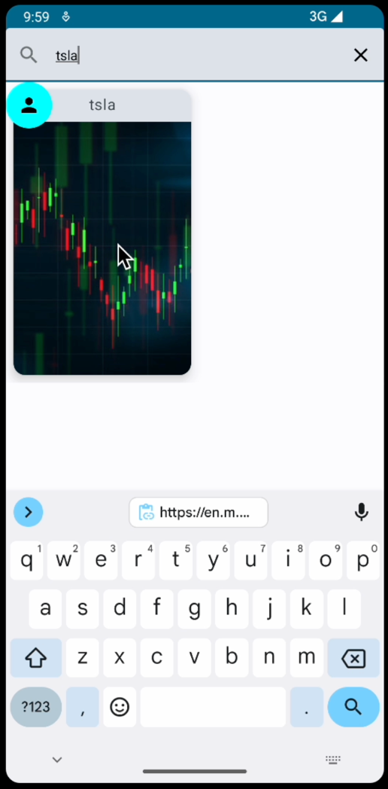
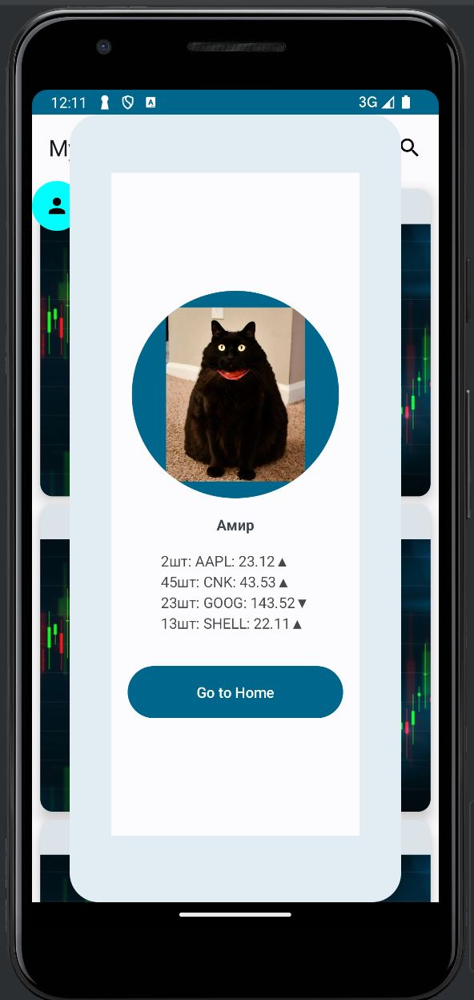

# My Jetpack Frontend

## The full project is here https://github.com/Ramazuki/PRDInvest-Application

### Team work:
- 1 develops ui (me)
- 2 develops backend
- 1 responsible for tests
- 1 project/product manager

### Functionality
- Buying/selling shares
- View the transaction report
- Current quotes
- Change profile photos

### UI Layer
User interface implemented in Kotlin using the Jetpack Compose framework and Retrofit
2 + Coil Compose libraries.

### Promo video of app usage
### [Promo.mp4](https://drive.google.com/file/d/1AEoQsZrwmMFpm6OsAZKuHZ5iqOPYN8SS/view?usp=sharing)

